# Stealthburner_LGX_Mount
## Introduction

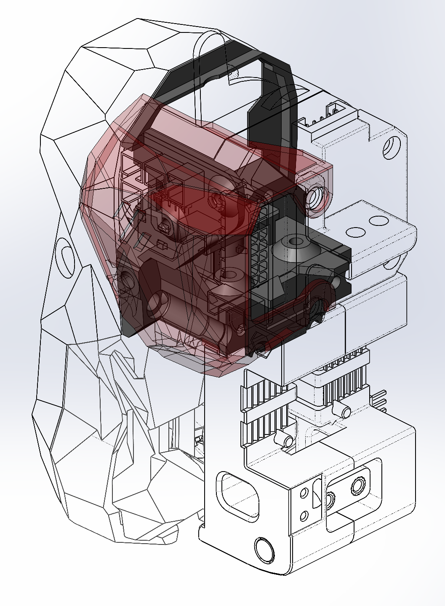
I didn't find a mounting with some bells and whistles I wanted to use my LGX with the Stealthburner. Then I designed my own.

It be compatible with both versions of rail carriage. The one we screw on the back (Afterburner carriage) and the one we screw on the front (Stealthburner carriage). I only fully tested with the Stealthburner carriage.

The 3D printed parts may not follow the Voron design recommendations.

All photos are not of the same model version. I didn't want to shoot the whole sequence of the mounting after each design iteration.
## Parts
3D printed:
- LGX mount (2 objects)
- LGX wheel cover

Additional hardware:
- M3x20 (x2). SHCS / ISO 4762 recommended
- M3x30 (x2). SHCS / ISO 4762 recommended
- M3x6 (x1). FHCS / ISO 10642 recommended
- M3 Heat insert (x3).

## Mounting
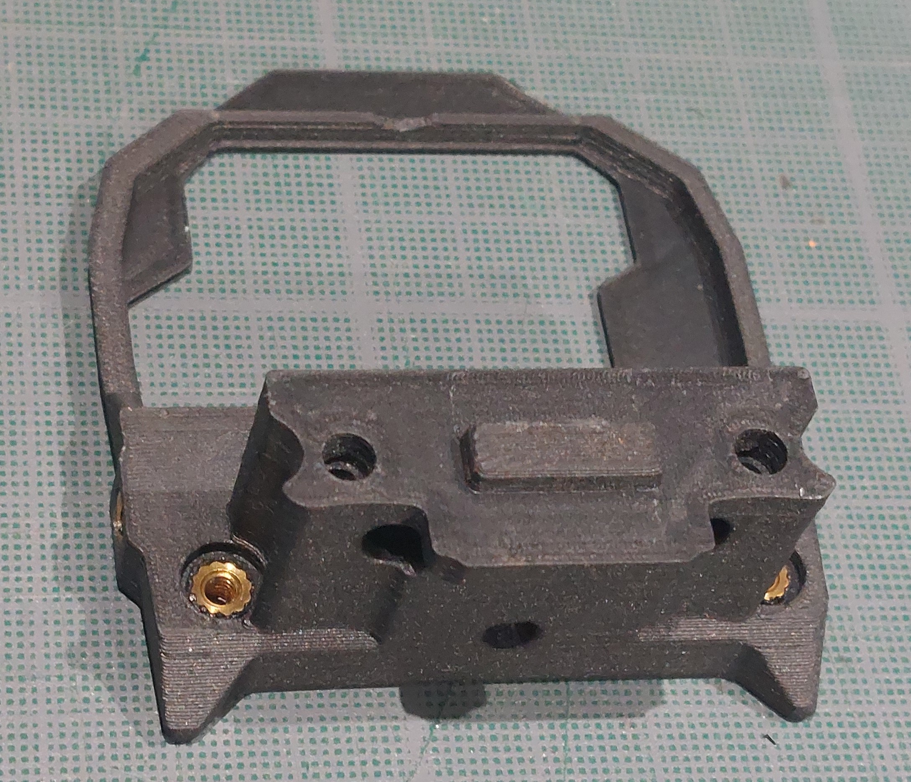
Put insert in the 3 holes.

Take care to get the insert quite well straight. It is for the stealthburner to move easily on the M3x25 screws afterward when you want to swap the toolhead.

The insert on the left (of the photo) edge is to screw a future cover.

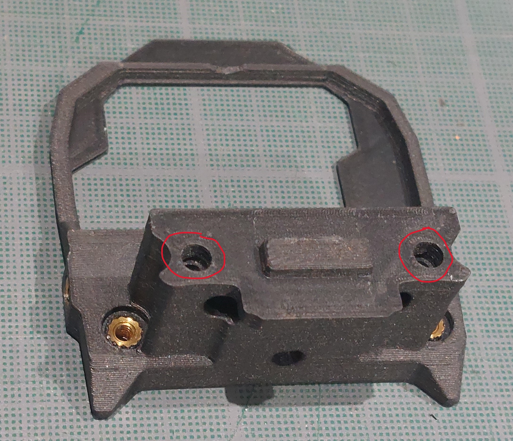
In case you want to use the rail carriage that has holes to screw on the back, add insert in the highlighted holes.

Add the back of the mounting. It should fit on the rectangular joint. It doesn't have to be separated from the mounting. Then I choose to glue it but it is really not mandatory.

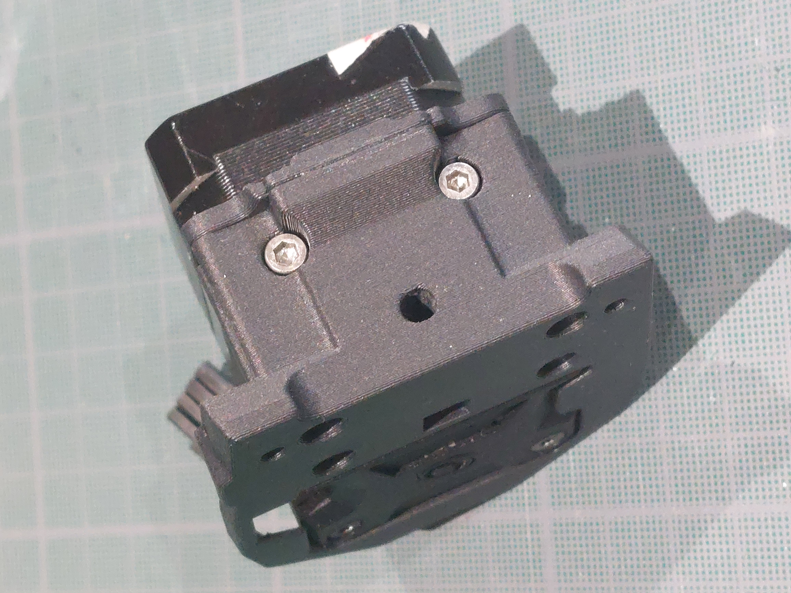
Screw the bottom with 2 M3x20.

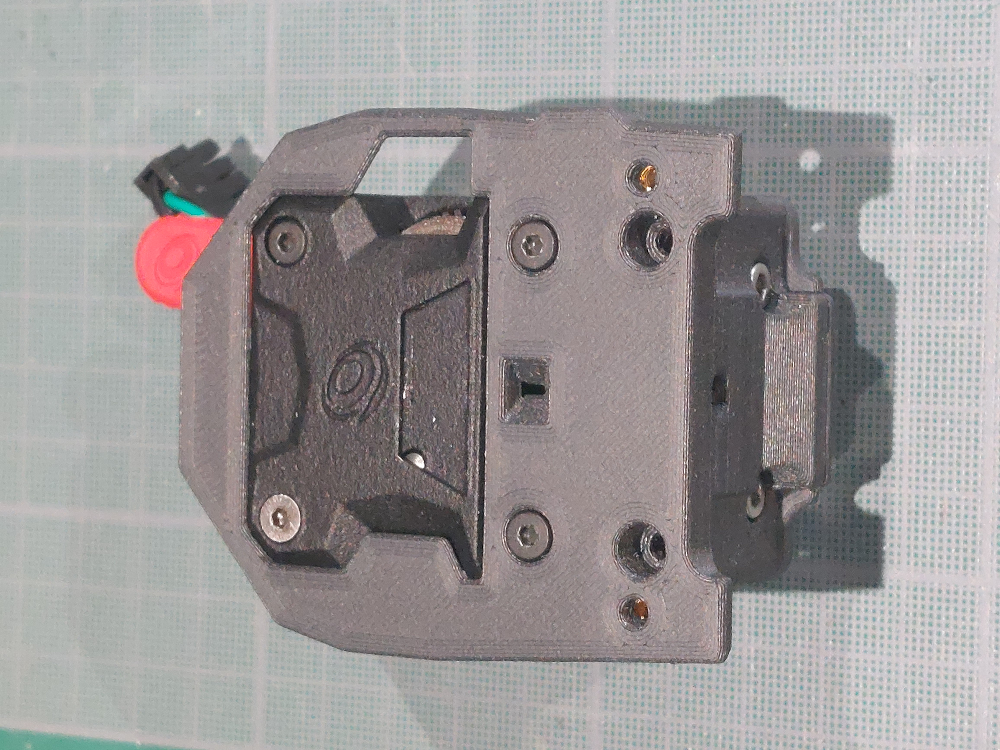
Screw the front with the Bondtech M3x27.

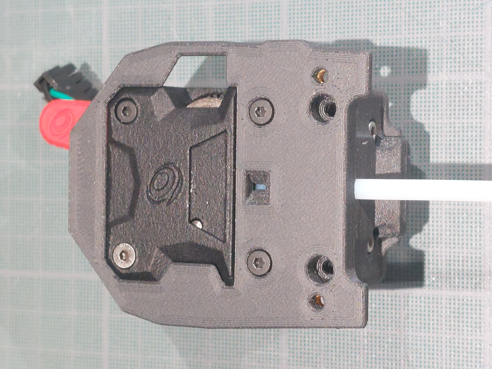
There is a hole in the front of the mounting to check if the PTFE tube go well to the top of the mounting.

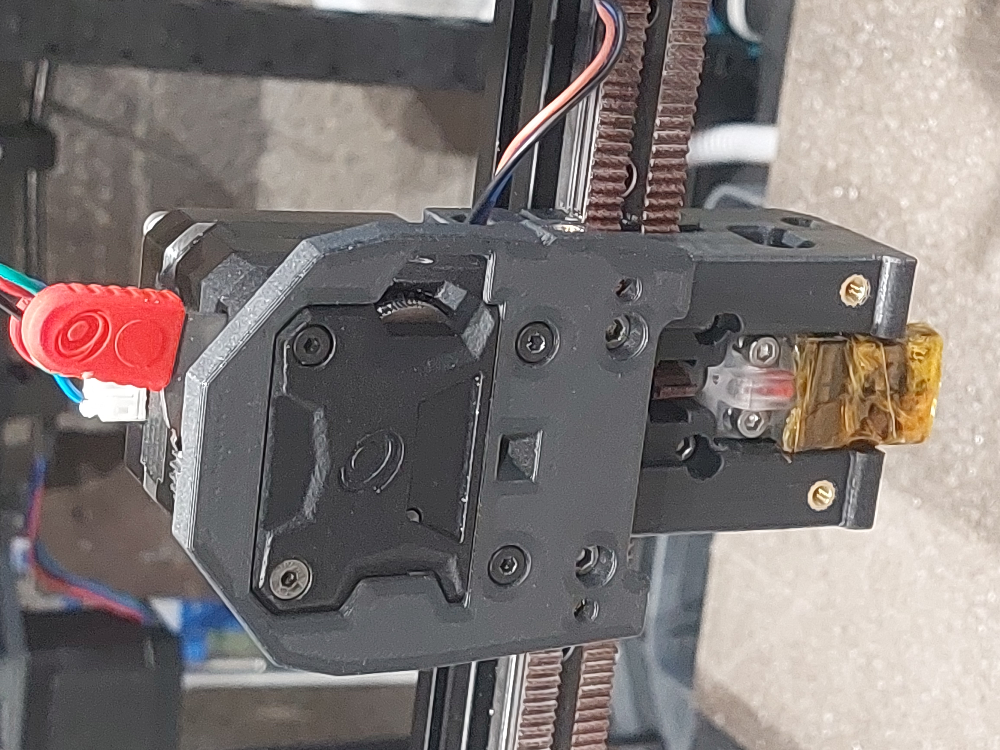
Screw the mounting on the Carriage with 2 M3x30.

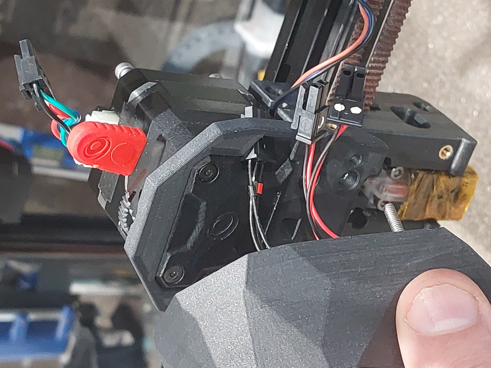
Pass the Stealthburner wires with their connectors in the right square hole.

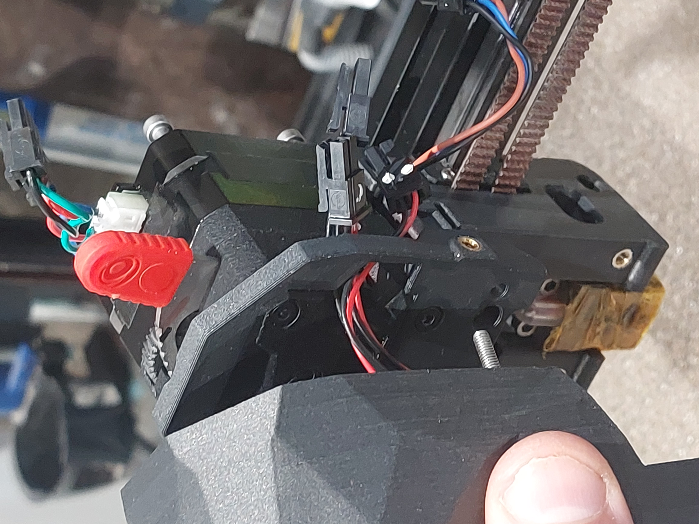
All 3 connectors passed.

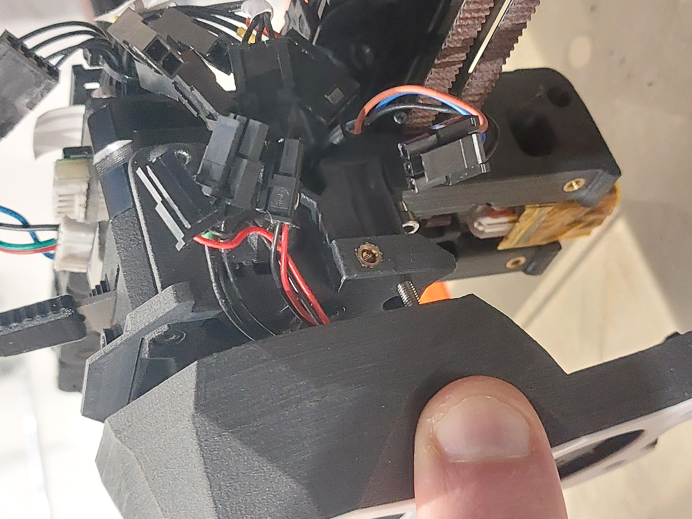
Screw few turns the Stealthburner M3x25 to hold it.

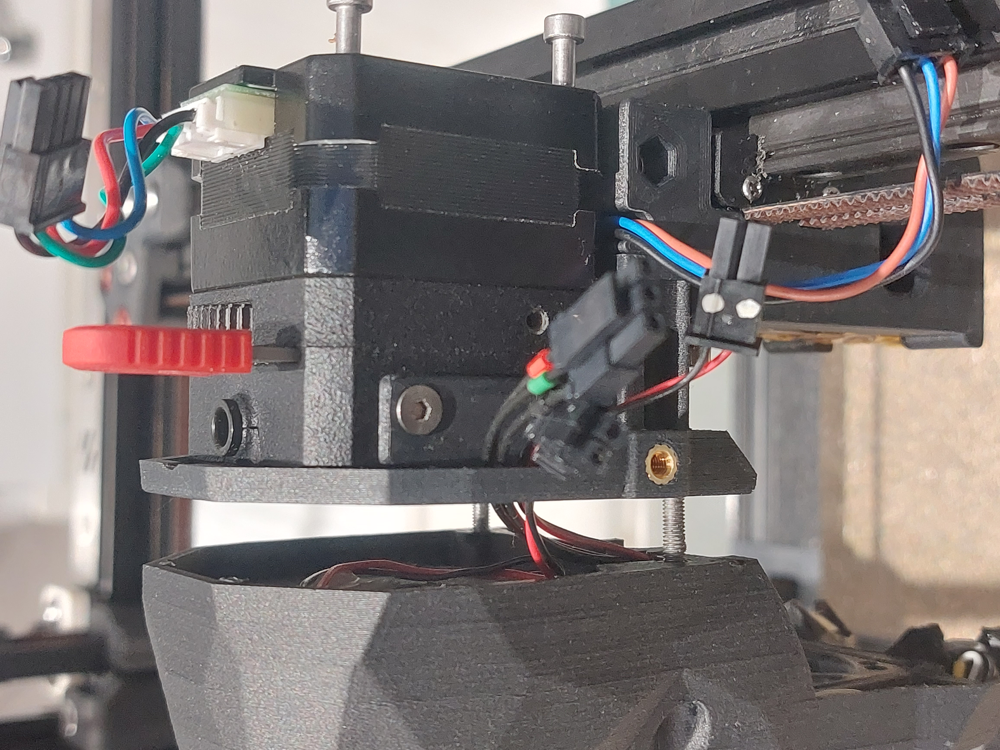
Screw the LGX wheel cover with a M3x6. I use a FHCS one.

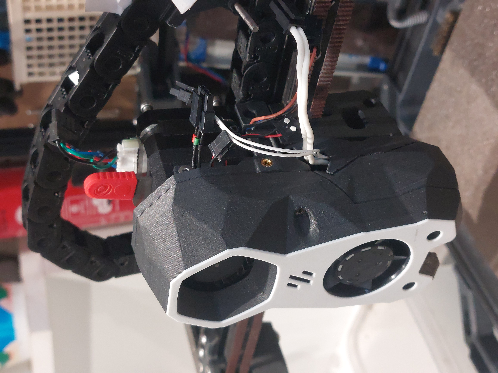
Mount the toolhead. Take attention to not pinch the toolhead wires between the Stealthburner and its mounting when tighning the whole.

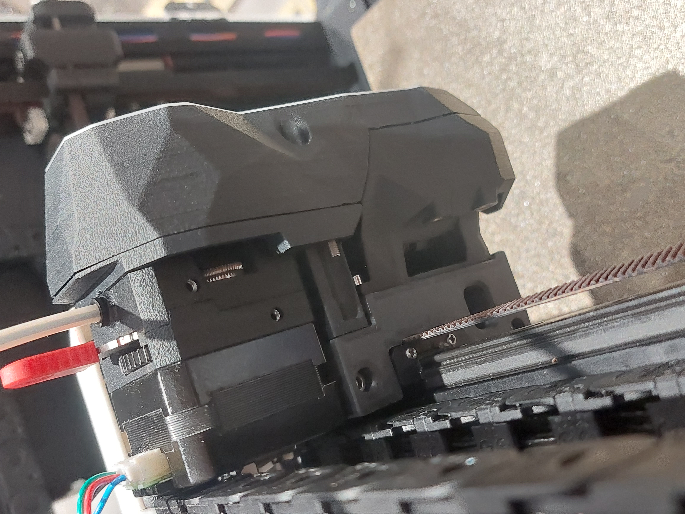
Voilà.
## Cover

The dimensions to design a future cover.