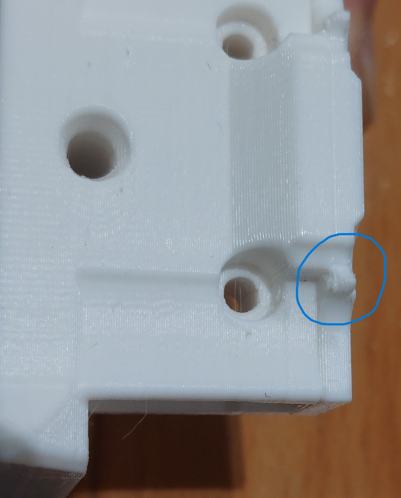

# Stealthburner_LGX_Mount

***

1. [Introduction](#introduction)
2. [Credits](#credits)
3. [Parts](#parts)
4. [LGX Mounting](#lgx-mounting)
5. [Features I took care of](#features-i-took-care-of)

***

## Introduction

I didn't find a mounting with some bells and whistles I wanted to use my LGX with the Stealthburner. Then I designed my own.

It is be compatible with both versions of rail carriage. The one we screw on the back (Afterburner carriage with CW1) and the one we screw on the front (Stealthburner carriage with CW2).

The Afterburner PCB (LDO) mounting is optionnal. I'm trying to implement the Stealthburner PCB.

The 3D printed parts may not follow the Voron design recommendations.

All photos are not of the same design iteration. I didn't want to shoot the whole sequence of the mounting each time I improved the parts.

## Credits

- Thanx to @errornumber419 for the design of adding the PCB support directly on the mounting.

- The cover is based on wile.e1 cover for Stealthburner and CW1 (<https://github.com/VoronDesign/VoronUsers/tree/master/printer_mods/wile-e1/Stealthburner_CW1_PCB_Cover>)

## Parts

- Mounting options
  - Normal files are in "Standard" folder
  - OctotapV2 files are in "OctotapV2" folder. You can use OctotapV2 files even if you don't have it. It does only level up the mounting to 2mm to set some clearance for the OctotapVé PCB.

| CW1 carriage | CW2 carriage | All in one part | PCB Support | Files to print|
|:---:|:---:|:---:|:---:|---|
|No|Yes| Yes | No | LGX_SB_Mount-rxxx - 1-2-NoPCB |
|No|Yes| Yes | Yes | LGX_SB_Mount-rxxx - 1-2-PCB |
|Yes|Yes| No | No | LGX_SB_Mount-rxxx - 1-NoPCB / LGX_SB_Mount-rxxx - 2 |
|Yes|Yes| No | Yes | LGX_SB_Mount-rxxx - 1-PCB / LGX_SB_Mount-rxxx - 2|

- Cover

| File to print |
|---|
| [a]_LGX_SB_Cover-rxxx - Standard |

- Additional hardware
  - M3x20 (x2). SHCS / ISO 4762 recommended
  - M3x30 (x2). SHCS / ISO 4762 recommended (M3x25 is enough for the screws on the back mounting)
  - M3x6 (x2). BHCS / ISO7380-1 for the PCB in case you have one.
  - M3 Heat insert (x3).

## LGX Mounting

Put insert in the 3 holes.

Take care to get the insert quite well straight. It is for the Stealthburner to move easily along the M3x25 screws afterward when you want to swap the toolhead.

The insert on the left (of the photo) edge is to screw the cover.

In case you want to use the rail carriage that has holes to screw on the back (CW1), add two more inserts in the back of the part.

    Add the back of the mounting. It should fit on the rectangular joint. Later, it doesn't have to be separated from the mounting. Then I choose to glue it but it is really not mandatory.

Screw the bottom with 2 M3x20.

Screw the front with the provided Bondtech LGX M3x27.

Screw the mounting on the carriage with 2 M3x30.

In case you want to use the rail carriage that has holes to screw on the back (CW1), screw the mounting on the carriage with 2x M3x25 or 2x M3X30.

Screw few turns the Stealthburner M3x25 to hold it.

Mount the toolhead. Take attention to not pinch the toolhead wires between the Stealthburner and its mounting when tighning the whole.

Screw the cover and Voilà.

## Features I took care of

- Works for CW1 and CW2 rail carriage models.
- Inserts for Stealthburner Fan assembly on the good side.

- Can see how far goes your PTFE tube

- Keep some place for your fingers to access the reverse Bowden tube fitting

- Optionnal PCB mounting

- Access to rail top mounting screws

- Access to Toolhead positionning screws

- Take care of the clearance between the side cover and the cable chain when X=0

- Printing the mounting in one piece despite some printing in the air. It is still functionnal.
One piece:

Two Pieces (better):

